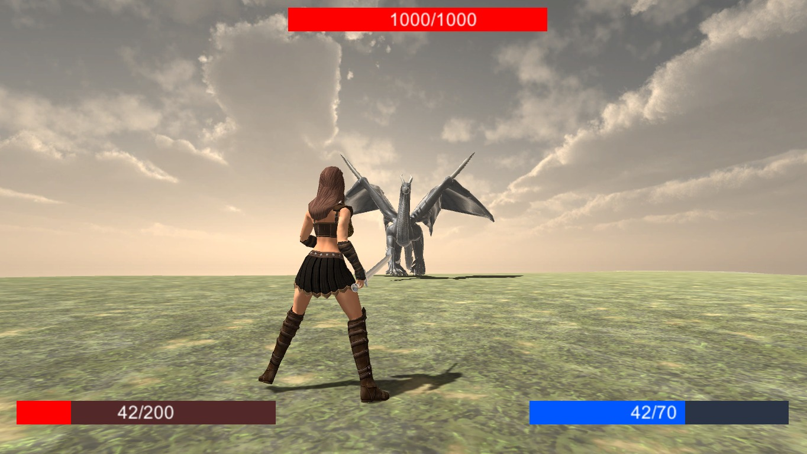

# Atlas
A fantasy open-world RPG game with world full of monsters and secrets. In Atlas, you may explore, fight, loot, improve, die and try again. Should you survive long enough, you may even face a dragon whom all other monsters serve.

  
  
  

Documents:
*   [Concept](docs/concept.pdf)
*   [Design Document](docs/designdoc.pdf)
*   [After Action Report](docs/aareport.pdf)
*   [User Manual](docs/userman.pdf)

Athors:
*   Vojtěch Foret
*   Jan Tóth
*   Markéta Jarkovská